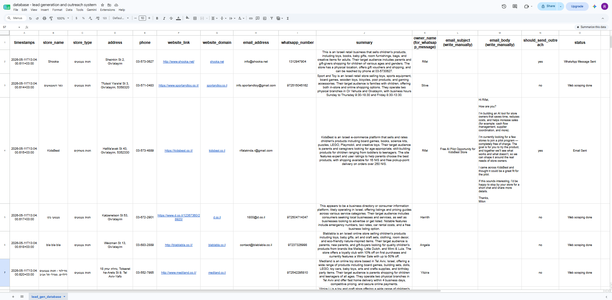
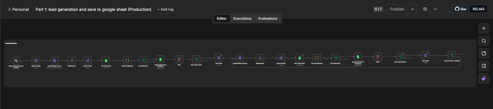
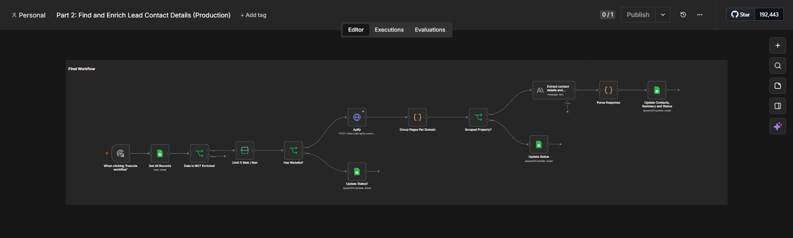
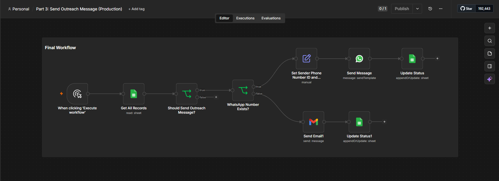
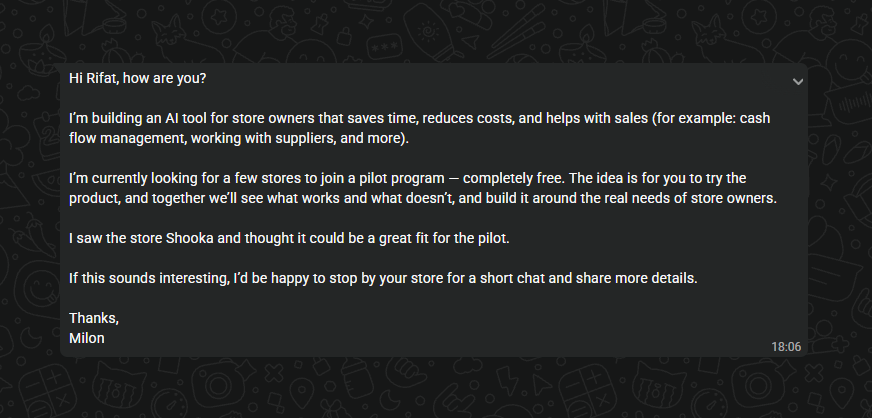
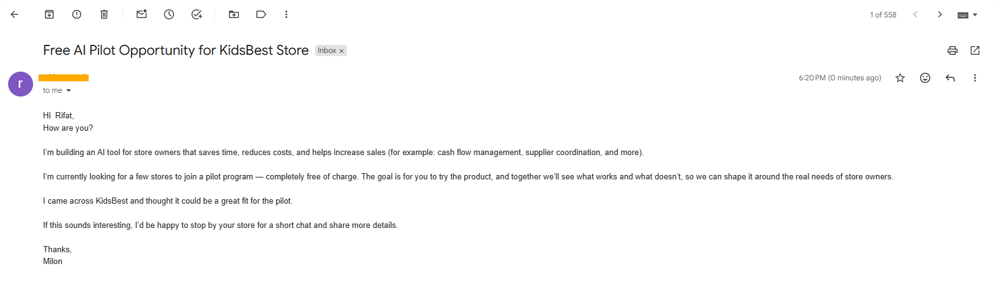

<div align="center">

# ⚙️ MapToChat

### End-to-End B2B Lead Generation, AI Enrichment & Omnichannel Outreach

[](https://n8n.io/)
[](https://apify.com/)
[]()
[]()
[]()
[](https://semver.org/)

<br/>

> **MapToChat** is an autonomous, three-stage operational platform engineered specifically for hyper-local B2B lead generation and targeted outreach. 
> - **Stage 1 (Discovery):** Queries Google Maps via SerpAPI to aggregate local businesses based on specific niche search intents and target locations.
> - **Stage 2 (Deep Enrichment):** Deploys an advanced Apify stealth crawler to bypass Cloudflare and intercept network traffic, extracting hidden contact data from chat widgets. An Anthropic Claude LLM then parses the unstructured website DOM to identify the business owner and summarize the company.
> - **Stage 3 (Omnichannel Outreach):** Following human-in-the-loop approval, it automatically formats phone numbers and sequences personalized outreach messages via the WhatsApp Business Cloud API, with automated email fallback.
> 
> *Scraping the web. Enriching the data. Closing the lead.*

<br/>

</div>

---

## 📑 Table of Contents

- [Why MapToChat?](#-why-maptochat)
- [Database & CRM Engine](#-database--crm-engine)
- [Core Capabilities & Workflows](#-core-capabilities--workflows)
  - [1. Local Search & Discovery](#1-local-search--discovery-serpapi)
  - [2. Stealth DOM Crawling & AI Parsing](#2-stealth-dom-crawling--ai-parsing-apify--claude)
  - [3. Human-in-the-Loop & Omnichannel Outreach](#3-human-in-the-loop--omnichannel-outreach)
- [Outreach Delivery Examples](#-outreach-delivery-examples)
- [Technical Stack](#️-technical-stack)
- [Safety, Privacy & Compliance](#-safety-privacy--compliance)
- [Getting Started](#-getting-started)
- [License](#-license)
- [Author](#-author)

---

## 🎯 Why MapToChat?

| Problem | The MapToChat Solution |
|---|---|
| **Manual Prospecting** | Automatically scrapes and parses paginated SerpAPI Google Maps results for local businesses. |
| **Missing Contact Info** | A custom stealth crawler extracts hidden WhatsApp numbers deeply embedded in JS chat plugins (Chaty, Wati, Elfsight, Premio). |
| **Anonymous Leads** | Anthropic's Claude LLM scans the website DOM for specific founder cues (e.g., `"I am [name]"`, `"founder"`, `"CEO"`) to extract the actual owner's name. |
| **Duplicate Outreach** | Maintains a centralized Google Sheets CRM that cross-references clean URL domains to prevent scraping or messaging the same business twice. |
| **Siloed Communication** | Automatically dispatches personalized WhatsApp messages using official Meta templates, or falls back to Gmail. |

---

## 📊 Database & CRM Engine

At the core of the system is an automated Google Sheets database that acts as the single source of truth, routing leads through the pipeline statuses (`Web scraping done`, `WhatsApp Message Sent`, `Email Sent`) and preventing duplicates.



---

## ⚡ Core Capabilities & Workflows

### 📍 1. Local Search & Discovery (SerpAPI)
Powered by **SerpAPI**, the system bypasses Google Maps rate limits to perform targeted local searches. It dynamically concatenates the `store_type` (e.g., `"Software Agencies"`) and `location` (e.g., `"New York"`) with the appropriate Google country code to extract:
- Store Name & Type
- Physical Address
- Phone Number & Website Link

A custom JavaScript engine parses the raw website URL into a clean domain, checking the Google Sheets CRM to silently skip duplicates before logging new prospects with the status: `Google maps scraping done`.



---

### 🕷️ 2. Stealth DOM Crawling & AI Parsing (Apify + Claude)
When a website is found, the system batches records (capped at **5 leads per run** via a Limit node to control API usage) and triggers a highly advanced **Apify Stealth Crawler**. The custom injected `pageFunction` script performs deep forensic extraction:
- **Cloudflare Bypass:** It actively detects Cloudflare challenge screens (`cf-wrapper`) and gracefully halts to prevent bot detection penalties.
- **Network Interception:** It monitors HTTP responses in real-time to intercept WhatsApp numbers hiding inside dynamic plugins like `chaty`, `wati`, `elfsight`, `premio`, and `tidio`.

The raw, unstructured chaos of the scraped DOM and metadata is then passed directly to an **Anthropic Claude** LLM node with temperature set to `0`. Acting as a strict JSON-only responder, the LLM processes a highly engineered prompt to extract and validate the following:
- **Contact Validation:** It prioritizes explicitly found emails/numbers, falling back to parsing the crawler's array of `all_emails_found` and `all_whatsapp_found` to select the most reliable contact.
- **Intelligent Owner Extraction:** It evaluates the `owner_hints` array first. If empty, it creatively parses personal email prefixes (filtering out generic aliases like `info@` or `support@`) to deduce the owner's first name. As a final fallback, it scans the raw website text for specific founder cues.
- **Business Summarization:** It generates a concise 2-3 sentence English summary detailing what the business sells, its target audience, and notable operating details (hours, location, brands).

*Graceful Error Handling: If the LLM returns malformed JSON or the website has insufficient data, the workflow catches the error, retains the original row data, and flags the row with `Parse error`.*



---

### 🚀 3. Human-in-the-Loop & Omnichannel Outreach
A tertiary workflow acts as the final automated closer, utilizing a **Human-in-the-Loop (HITL)** approach. An operator reviews the AI summaries in the Google Sheet and explicitly types `yes` in the `should_send_outreach` column for approved leads. 

When triggered, the system polls for approved leads where status is not `Message Sent`:
1. **Dynamic Number Formatting:** A JavaScript parser ensures the number is perfectly formatted for the WhatsApp API, automatically prepending the correct regional country code if the local leading zero was dropped.
2. **Template Dispatch:** It fires a Meta-approved template via the WhatsApp Cloud API, injecting the `owner_name` and `store_name` as dynamic variables.
3. **Email Fallback:** If no WhatsApp number exists, it falls back to the Gmail OAuth2 API to send a customized, text-based email (using the manually written subject/body from the sheet).

The CRM status is immediately updated to `Message Sent` to guarantee the lead is never contacted twice.



---

## 📬 Outreach Delivery Examples

The ultimate goal of MapToChat is highly personalized, automated contact. Here is what the final output looks like to the targeted business owner:

<div align="center">
  
  <br/>
  <br/>
  
</div>

---

## 🛠️ Technical Stack

| Component | Technology | Role |
|:---|:---|:---|
| **Workflow Orchestration** | [n8n](https://n8n.io/) | Hosts the 3-part microservice architecture. |
| **Local Search API** | SerpAPI | Bypasses Google Maps rate limits to aggregate local businesses. |
| **Stealth Crawler** | Apify | Injects custom JS to bypass Cloudflare and extract deep DOM contacts. |
| **AI Parser** | Anthropic Claude | Converts unstructured website text and schema into clean JSON data. |
| **Database & Tracking** | Google Sheets API | Central CRM for tracking lead status and enforcing HITL approvals. |
| **Messaging** | WhatsApp API & Gmail | Executes the final omnichannel outreach using localized templates. |

---

## 🔒 Safety, Privacy & Compliance

- **Strict Deduplication:** The CRM acts as a unified source of truth. The custom domain parser ensures no business is ever scraped or messaged twice, protecting your domain reputation and sender score.
- **LLM Hallucination Guards:** The Claude LLM is locked at `temperature: 0` and prompted strictly as a JSON-only responder, ensuring it never hallucinates fake contact data or breaks the n8n pipeline structure.
- **Human-in-the-Loop Control:** The segmented 3-part architecture strictly prevents automated spam. Outreach is structurally blocked until a human manually sets `should_send_outreach = yes` for each specific row.

---

## 🚀 Getting Started

### Prerequisites
- An active [n8n](https://n8n.io/) instance.
- API keys for [SerpAPI](https://serpapi.com/), [Apify](https://apify.com/), and [Anthropic](https://console.anthropic.com/).
- A [Meta Developer](https://developers.facebook.com/) account with the **WhatsApp Cloud API** configured.
- A [Google Workspace](https://workspace.google.com/) account with **Sheets** and **Gmail OAuth2** credentials configured.

### Setup & Installation

**1. Get the project files**
To get access to the official project files and custom Apify scripts, please contact the author ([Md. Rifat Aknda](https://github.com/rifatmilon)) directly. Once you receive the project directory, navigate into it:
```bash
cd <your-project-directory>
```

**2. Import the workflows into n8n**
- Open your n8n dashboard.
- Go to **Workflows** → **Import from File**.
- Import each `.json` workflow file included in the project directory.

**3. Configure Credentials**
Assign the following credentials in your n8n workspace:
- `SerpAPI` — API key
- `Apify` — API token
- `Anthropic API` — API key
- `WhatsApp Cloud API` — Meta Phone Number ID & access token
- `Google Sheets OAuth2 API` — Google Cloud OAuth2 credentials with Sheets scope
- `Gmail OAuth2 API` — Google Cloud OAuth2 credentials with Gmail send scope

**4. Prepare the CRM**
Create a Google Sheet matching the exact schema (`<store_name>`, `<website_domain>`, `<status>`, `<should_send_outreach>`, etc.) and link it to the Google Sheets nodes in all three workflows.

**5. Execute Discovery**
Trigger Part 1 to run your first SerpAPI query and watch the database populate!

---

## 📄 License

This project is licensed under a **Non-Commercial & Educational License** — see the [LICENSE](LICENSE) file for details.

-   **Allowed:** Free use, modification, distribution, and study for personal, research, academic, and educational purposes.
-   **Prohibited:** Commercial use, distribution, or integration into commercial property products without explicit written permission from the author.

---

## 👤 Author

<div align="center">

**Md. Rifat Aknda**

*AI/ML & Automation Engineer · AI/ML & IoT Researcher*

[](https://github.com/rifatmilon)
[](https://www.linkedin.com/in/rifatmilon/)
[](https://scholar.google.com/citations?user=qPC0U2gAAAAJ)

</div>
